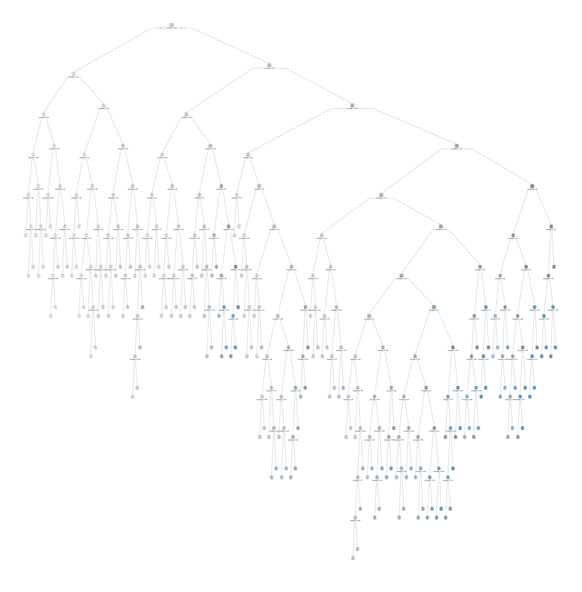

```{r setup, include=FALSE}
knitr::opts_chunk$set(echo = TRUE)
```

! CHANGE LATER ! We are viewing distribution of humidity because we want to use this as our response. Humidity is our response because it has the most natural variation in Santa Barbara and has implications for climate change, epidemiology, electronics, and other major aspects of modern life.<br /><br />

# Exploratory Data Analysis<br /><br />

Before anything else, we must load all of our packages. You can see the full list of packages I am using below.

```{r loading_libraries, message=FALSE}
library(tidymodels)
library(ISLR)
library(ISLR2)
library(discrim)
library(poissonreg)
library(corrr)
library(klaR)
library(dplyr)
library(ggplot2)
library(glmnet)
library(parsnip)
library(janitor)
library(corrplot)
library(randomForest)
library(rpart)
library(rpart.plot)
library(regclass)
library(broomstick)
```

<br /><br />

### Reading in Data<br /><br />

Now that that's out of the way, it's time to read in my data. I used `clean_names()` from the `janitor` package to make my data easier to wrangle. Before reading in this csv, I spent a lot of time cleaning it in Excel - there were about four weeks of missing data in which absolutely no data was read. I simply removed those rows as there was no use for them, and out of my \>2000 (now 2530) observations they constituted a very small part. I will also make sure R can read my date values as dates rather than characters, and add a `year_month` variable in order to calculate monthly averages. This makes some of my data, such as precipitation, temperature, and humidity, far easier to plot.

```{r data_setup_cleaning}
weather <- read.csv("weatherdatanew.csv") %>% clean_names()
# We clean the variable names to make the code easier to write
weather$date <- as.Date(weather$date, format="%m/%d/%y")
# Cleaning date values
weather <- weather %>% mutate(year_month=format(date, "%y/%m"), .before=date)
# Adding year_month variable in order to create monthly averages for weather values

```

<br /><br />

### Correlation Matrix<br /><br />

Now it's time to start my EDA. Below, I created a correlation matrix of all of my variables in order to highlight important relationships between the predictors and response.

```{r corrplot}
weather %>% 
  dplyr::select(where(is.numeric)) %>% 
  cor() %>% 
  corrplot(type = 'lower', diag = FALSE, 
           method = 'color')
# Correlation matrix of all numeric variables in order to ascertain which correlations stand out
```

<br /><br /> The correlation matrix has some interesting implications - while some of the relationships were anticipated, such as the correlation between average wind speed and maximum wind speed, some others were less obvious. In particular, the moderate negative correlation between average humidity and maximum wind speed and the strong positive correlation between average dew point and humidity stood out to me. Thinking about it, these relationships make sense. High wind speed means that water molecules in the air are spread further apart from each other, so it's harder for them to condense - thus, dew point is lower. Average dew point is also related to humidity in that dew point is the air temperature at which relative humidity would be 100% - water then begins to condense into dew. If humidity is high, it makes sense that the dew point would not have to be as low for relative humidity to reach 100% and for water to start condensing. <br /><br />

## Exploring Individual Variables<br /><br />

I'd like to find out if there are any patterns in my data, so I've plotted several line graphs below, each exploring one of the variables. <br /><br />

### Average Monthly Humidity<br /><br />

```{r plotting_humidity, fig.width=15}
humidity_avg <- aggregate(average_humidity ~ year_month, weather, mean)
# Aggregate means of monthly humidity in a new data frame
h <- ggplot(data=humidity_avg, aes(x=year_month, y=average_humidity, group=1)) + 
  geom_line() + labs(y="Average Humidity", x="Year/Month")  
# Store plot for monthly average humidity
h + theme(axis.text.x = element_text(angle = 90))
# Show plot while rotating x-axis values 90 degrees to prevent crowding
```

<br /><br /> While this graph is somewhat rough, it still makes sense - humidity tends to peak most in the warmest months, as increased sunlight and heat causes more water to evaporate from the ocean and flora/fauna on land. <br /><br />

### Average Monthly Temperature/Dew Point<br /><br />

```{r plotting_temp_dew, fig.width=15}
temp_avg <- aggregate(average_temperature_o_f ~ year_month, weather, mean)
# Aggregate means of monthly temp in a new data frame
dew_avg <- aggregate(average_dew_point_o_f ~ year_month, weather, mean)
# Aggregate means of monthly dew point in a new data frame

total1 <- merge(humidity_avg, temp_avg, by="year_month")
total <- merge(total1, dew_avg, by="year_month")
ggplot(data=total, aes(x=year_month)) + 
  geom_line(aes(y = average_temperature_o_f, group=1, color="Temperature")) + 
  geom_line(aes(y = average_dew_point_o_f, group=1, color="Dew Point")) + 
  theme(axis.text.x = element_text(angle = 90)) + labs(y="Degrees Fahrenheit", x="Year/Month")
```

<br /><br /> As expected, monthly average temperature and dew point closely follow each other. As temperatures increase, the temperature at which water condenses from the air grows higher, as there is more water vapor in the air. This correlates well with the humidity graph as well, which has peaks in warmer months.

<br /><br />

### Total Monthly Precipitation<br /><br />

```{r plotting_precip, fig.width=15}
precip_month <- aggregate(precipitation_in ~ year_month, weather, sum)

ggplot(data=precip_month, aes(x=year_month)) + geom_line(aes(y=precipitation_in, group=1)) + 
  theme(axis.text.x = element_text(angle = 90)) + labs(y="Total Precipitation", x="Year/Month")
```

<br /><br />

This graph is hardly surprising. Precipitation peaks regularly between November and April every year, with the height of the peaks varying depending on whether a drought is currently in effect as well as other environmental factors.

<br /><br />

### Daily Average Pressure<br /><br />

```{r plotting_pressure, fig.width=15}
ggplot(data=weather, aes(x=date)) + geom_point(aes(y=average_pressure_in_hg, group=1)) + 
  theme(axis.text.x = element_text(angle = 90)) + labs(y="Average Pressure (inHg)", x="Date")
```

<br /><br /> Since Santa Barbara Airport is very close to sea level, pressure stays very stable in the area. Still, some peaks and troughs are visible in this scatterplot, though they are shallow. Notably, four points stand out as outliers below the graph - I imagine these are recording errors, or days of exceptionally low pressure prior to a storm. There are a few other points that stick out slightly below and above the main line of the scatterplot, but they seem to be legitimate high- or low-pressure days rather than recording errors. <br /><br />

### Daily Average and Maximum Wind Speed<br /><br />

```{r plotting_wind, fig.width=15}
ggplot(data=weather, aes(x=date)) + geom_line(aes(y=average_wind_speed_mph, group=1, color="Average Wind Speed")) +
  geom_line(aes(y=maximum_wind_speed_mph, group=1, color="Maximum Wind Speed")) +
  theme(axis.text.x = element_text(angle=90)) + labs(y="Miles per Hour", x="Date")

```

<br /><br />

Interestingly, average and maximum wind speed both dip every year around December/January. I'm not sure exactly why this is, but I believe it has to do with the fact that air pressure tends to stay low around that time of year, so there is not much movement of air.

<br /><br />

# Modeling<br /><br />

Now it's time to model the data. I'm choosing four models: a regression decision tree, a random forest with bagging, a boosted trees model, and a linear regression model.

### Initial split<br /><br />

Since my dataset is relatively small (2530 observations), I'm choosing a 75-25 training-testing split and only creating 5 cross-validation folds with 5 repeats. I'm stratifying on the outcome variable as well.<br /><br />

```{r initial_split}

set.seed(3945)
weather_split <- initial_split(weather, prop=0.75, strata=average_humidity)
weather_train <- training(weather_split)
weather_test <- testing(weather_split)
weather_fold <- vfold_cv(weather_train, v=5, strata=average_humidity, repeats=5)

```

<br /><br />

### Recipe creation<br /><br />

Date variables are tiresome to integrate into our models, especially considering they do not fit neatly into numeric values, so we will leave them out when creating our recipe.<br /><br />

```{r recipe}

weather_recipe <- recipe(average_humidity ~ average_temperature_o_f + average_dew_point_o_f + maximum_wind_speed_mph + average_wind_speed_mph + average_pressure_in_hg + precipitation_in, data=weather_train)

```

<br /><br />

## Model creation

<br /><br />

### Regression Tree

<br /><br />

First we fit a regression decision tree. We are tuning cost_complexity and tree_depth, then choosing the best model out of a tuning grid with 5 levels. After selecting the best decision tree, we will plot it so we can visualize it.<br /><br />

```{r load_dectree, echo=FALSE}

load(file="regtree_models.RData")

```

```{r decision_tree, eval=FALSE}
set.seed(3945)
regtreespec <- decision_tree() %>%
  set_engine("rpart") %>%
  set_mode("regression")

tree_fit <- regtreespec %>%
  fit(average_humidity ~ maximum_wind_speed_mph + average_wind_speed_mph + average_pressure_in_hg + precipitation_in + average_temperature_o_f + average_dew_point_o_f, data=weather_train)

regtreewf <- workflow() %>%
  add_model(regtreespec %>% set_args(cost_complexity = tune(), tree_depth = tune())) %>%
  add_formula(average_humidity ~ maximum_wind_speed_mph + average_wind_speed_mph + average_pressure_in_hg + precipitation_in + average_temperature_o_f + average_dew_point_o_f)

param_grid <- grid_regular(cost_complexity(), tree_depth(), levels = 5)

tune_res <- tune_grid(
  regtreewf,
  resamples = weather_fold, 
  grid = param_grid
)

bestcomplexity <- select_best(tune_res, metric = "rmse")

regtreefinal <- finalize_workflow(regtreewf, bestcomplexity)

regtreefinalfit <- fit(regtreefinal, data = weather_train)

getcp(extract_fit_engine(regtreefinalfit))

plotcp(extract_fit_engine(regtreefinalfit))

regtreefinalpruned <- prune(extract_fit_engine(regtreefinalfit), cp=1.524155e-05)

save(regtreespec, tree_fit, regtreewf, param_grid, tune_res, bestcomplexity, regtreefinal, regtreefinalfit, regtreefinalpruned,  file="regtree_models.RData")

```
```{r plot_dectree, include=FALSE}
tiff("test.tiff", units="in", width=11, height=11, res=1500)

regtreefinalpruned %>%
  rpart.plot(roundint = FALSE, varlen = -9, fallen.leaves = FALSE)

dev.off()

```
<br /><br />
I used the `getcp()` function to find the tree that would result in the lowest level of cross-validation error, that being this tree. Now we can look at our decision tree: it's extremely large, with dozens of nodes. <br /><br />
<br /><br />
This looks like it might be a bit overfitted, but we'll see how it turns out when we try to predict our testing data. A detailed image of the whole tree is available at the link in DecisionTree.txt. Note that the file is about 1.09 GB and so will take some time to load - you will need to zoom in to view the whole tree. One main thing to note is that the tree model only chose *two* predictors: `average_temperature_o_f` and `average_dew_point_o_f`. Evidently, these two predictors are the most relevant to humidity, with other factors not predicting it as accurately.
<br /><br />

Let's look at how well this tree predicts the testing set.
<br /><br />
```{r}

weather_test %>%
  mutate(
    .pred=predict(regtreefinalpruned, weather_test)
  ) %>% 
  rmse(truth=average_humidity, estimate=.pred)

```
<br /><br />
Our tree is actually surprisingly accurate! Using the cp value provided by `getcp()`, we find that the root mean square error is 2.56%. Considering that the humidity ranges from 27.4% to 99.5%, this is actually a pretty good margin of error. Our decision tree is fairly accurate.<br /><br />

We can also see a scatterplot of the actual data points compared to the predicted values:<br />

```{r}
weather_test %>%
  mutate(
    .pred=predict(regtreefinalpruned, weather_test)
  ) %>%
  ggplot(aes(average_humidity, .pred)) +
  geom_abline() +
  geom_point(alpha = 0.5)
```
<br /><br />
It looks like the points follow the line pretty well! Interestingly, the points start to get closer to the line as the percentages grow. The error grows larger the smaller the percentage. This is likely because Santa Barbara is located on the coastline, so humidity is quite stable in the 70-90% range. Because of this stability, most of the data points are located in that range as well, giving the model more data with which to predict humidity. Lower humidity levels are comparatively rare, so a lot more "noise" appears in the model.
<br /><br />

### Random Forest with Bagging

<br /><br />
Next we will fit a Random Forest model with bagging. We set `mtry` to 6 since there are 6 predictors. <br /><br />
```{r bagging_ran_for}

set.seed(3945)

bagging_spec <- rand_forest(mtry = 6) %>%
  set_engine("randomForest") %>%
  set_mode("regression")

bagging_fit <- fit(bagging_spec, average_humidity ~ average_temperature_o_f + average_dew_point_o_f + maximum_wind_speed_mph + average_wind_speed_mph + average_pressure_in_hg + precipitation_in, data = weather_train)

```

```{r save_ranfor, include=FALSE}

save(bagging_spec, bagging_fit, file="baggingranfor_models.RData")

```

```{r load_ranfor, echo=FALSE}

load(file="baggingranfor_models.RData")

```

```{r}


```

### Boosted Tree

```{r boosted_tree}

set.seed(3945)

boost_spec <- boost_tree(trees = 5000, tree_depth = 4) %>%
  set_engine("xgboost") %>%
  set_mode("regression")

boost_fit <- fit(boost_spec, average_humidity ~ average_temperature_o_f + average_dew_point_o_f + maximum_wind_speed_mph + average_wind_speed_mph + average_pressure_in_hg + precipitation_in, data = weather_train)

```

```{r save_boosted_tree, include=FALSE}

save(boost_spec, boost_fit, file="boostedtree_models.RData")

```

```{r load_boosted_tree, echo=FALSE}

load(file="boostedtree_models.RData")

```

### Linear regression

```{r lin_reg}

set.seed(3945)

lm_model <- linear_reg() %>% 
  set_engine("lm")

lm_wflow <- workflow() %>% 
  add_model(lm_model) %>% 
  add_recipe(weather_recipe)

lm_fit <- fit(lm_wflow, weather_train)

```

```{r save_lin_reg, include=FALSE}

save(lm_model, lm_wflow, lm_fit, file="linear_models.RData")

```

```{r load_lin_reg, echo=FALSE}

load(file="linear_models.RData")

```
